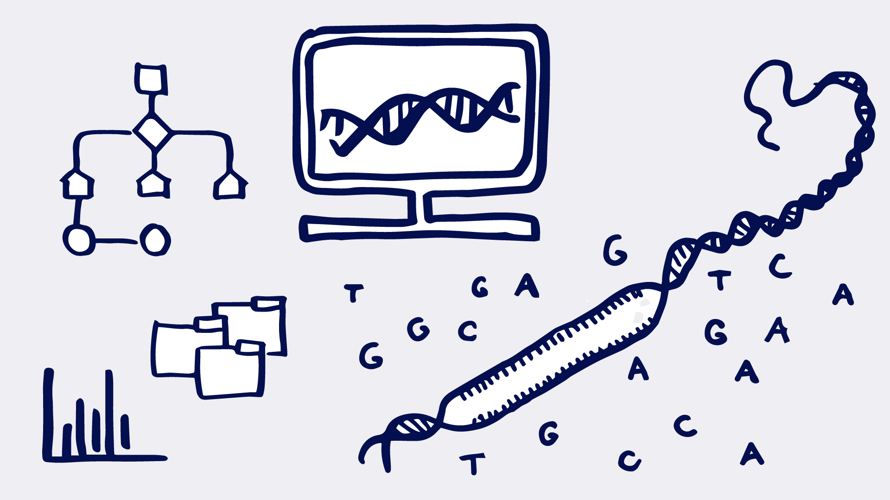

# DL-bioinform

# About
- This is an introductory Deep Learning course for graduate bioinformatics students of CS faculty @ HSE
- Lecture and seminar materials for each week are in ./week* folders, see README.md for materials and instructions
- Any technical issues, ideas, bugs in course materials, contribution ideas - add an issue

# Syllabus
- [__week00__](./week00) Cheatsheets
- [__week01__](./week01) Introduction to Course
    - Lecture: Introduction to Course
    - Seminar: Intro in `pytorch`
- [__week02__](./week02) Classification
    - Lecture: Neural networks definition, activation functions, and classification with cross-entropy
    - Seminar: Fully-Connected NN for binary classification
- [__week03__](./week03) Regularization and Optimization
    - Lecture: Overfitting, Dropout, BatchNorm, Optimization:
        - SGD, Adam, AdamW
        - LR Schedulers
    - Seminar: Gradient descent and its variations. SGD. Adam. BatchNorm, Dropout, ElasticNet

# Homeworks
Rules:
- Soft and Hard deadlines
- 2 weeks from the start before the soft deadline
- 1 additional week after the soft deadline before the hard deadline
- Penalty 10% to the grade for each day after soft deadline

### HW's list:
#### Practical:

- [__HW1__](./homeworks/practical/hw1)
    - Graded 10 pts maximum 
    - Soft deadline: 18.03.24, 15.00
    - Hard deadline: 25.03.24, 15.00
    - You lose 10% off your grade daily after the soft deadline.
    - You have 4 late days to mitigate this penalty. It could be used either towards the soft or the hard deadlines.

# Textbooks
## Main:
1. Deep Learning (Ian J. Goodfellow, Yoshua Bengio, and Aaron Courville), MIT Press, 2016.
2. Bishop, Christopher M. Pattern Recognition and Machine Learning. New York: Springer, 2006.

## Additional
1.  Deisenroth, Marc Peter, A. Aldo Faisal, and Cheng Soon Ong. Mathematics for Machine Learning. Cambridge: Cambridge University Press, 2020. Print.
2.  Murphy, Kevin P.. (2022). Probabilistic machine learning: an introduction. Massachusetts: MIT Press.
3.  Richard Szeliski. 2021. Computer Vision: Algorithms and Applications (2st. ed.). Springer-Verlag, Berlin, Heidelberg.

