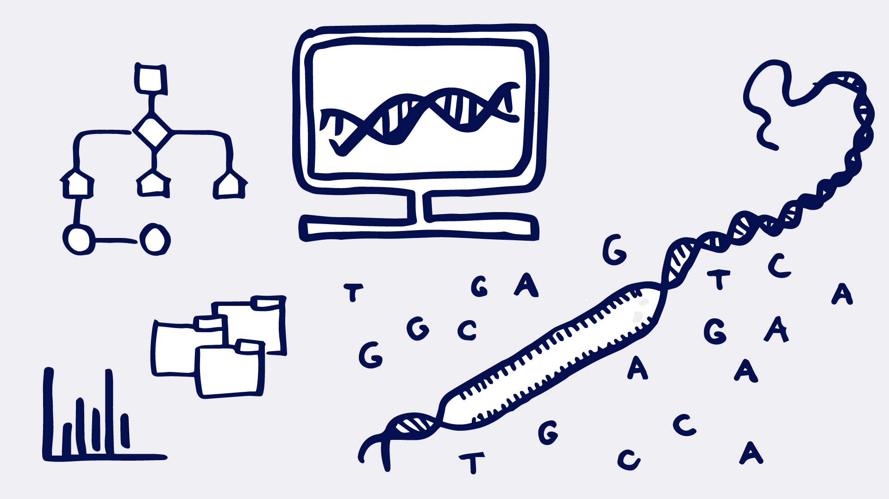

# DL-bioinform

# About
- This is an introductory Deep Learning course for graduate bioinformatics students of CS faculty @ HSE
- Lecture and seminar materials for each week are in ./week* folders, see README.md for materials and instructions
- Any technical issues, ideas, bugs in course materials, contribution ideas - add an issue

# Syllabus
- [__week00__](./week00) Cheatsheets
- [__week01__](./week01) Introduction to Course
    - Lecture: Introduction to Course
    - Seminar: Intro in `pytorch`
- [__week02__](./week02) Classification
    - Lecture: Neural networks definition, activation functions, and classification with cross-entropy
    - Seminar: Fully-Connected NN for binary classification
- [__week03__](./week03) Regularization and Optimization
    - Lecture: Overfitting, Dropout, BatchNorm, Optimization:
        - SGD, Adam, AdamW
        - LR Schedulers
    - Seminar: Gradient descent and its variations. SGD. Adam. BatchNorm, Dropout, ElasticNet
- [__week04__](./week04) Computer Vision
    - Lecture: Image Processing, Classification, CNN, Pooling, Architecture topology
    - Seminar: CNN for Image Processing (MNIST, CIFAR10)
- [__week05__](./week05) CNN Evolution
    - Lecture: LeNet, ImageNet, AlexNet, VGG, GoogLeNet, ResNet
    - Seminar: CNNs, Datasets, DataLoaders, Augmentations. ResNet for image classification
- [__week06__](./week06) Object Detection
    - Lecture: R-CNN, Fast R-CNN, Faster R-CNN, YOLO, RetinaNet
    - Seminar: Object Detection with Faster R-CNN on PASCAL VOC
- [__week07__](./week07) Segmentation
    - Lecture: Fully Convolutional Networks, U-Net
    - Seminar: Semantic segmentation with U-Net on OxfordIIITPet
- [__week08__](./week08) Text Embeddings
    - Lecture: Word Representations, Word2Vec, GloVe
    - Seminar: Word Embeddings, t-SNE/PCA visualization, similar question search
- [__week09__](./week09) Sequence Handling
    - Lecture: RNN, LSTM
    - Seminar: RNN for name generation, Image captioning with LSTM
- [__week10__](./week10) Attention and Transformer
    - Lecture: Seq2Seq, Attention mechanism, Transformer architecture
    - Seminar: GPT Language Model from scratch (character-level)
- [__week11__](./week11) Advanced Transformer
    - Lecture: Positional Embeddings, Transformer categories (Encoder-decoder, Encoder-only, Decoder-only)
    - Seminar: Llama3 from scratch
- [__week12__](./week12) LLMs
    - Lecture: Transfer Learning, Fine-tuning, RLHF
    - Seminar: Qwen3 implementation
- [__week13__](./week13) LLMs Training, Tuning, Tools
    - Lecture: LLMs Training and Tuning
    - Bonus Lecture: LLMs and Tools
- [__week14__](./week14) Transformer for Vision
    - Lecture: Vision Transformer (ViT)
    - Seminar: Vision Transformer (ViT) for Classification (CIFAR10)
- [__week15__](./week15) Time Series
    - Lecture: Time-series analysis — fundamentals (decomposition, stationarity, metrics, validation) and DL methods (Transformer-based architectures, Foundational models)
    - Seminar: DL for Time Series
- [__week16__](./week16) Guest Lecture (Bonus) — by Ali Ismailov
    - Bonus Lecture: Single-cell analysis applications in DL
    - Bonus Seminar: Glioblastoma classifier from single-cell data

# Homeworks
Rules:
- Soft and Hard deadlines
- 2 weeks from the start before the soft deadline
- 1 additional week after the soft deadline before the hard deadline
- Penalty 10% to the grade for each day after soft deadline

### HW's list:
#### Practical:

- [__HW1__](./homeworks/practical/hw1)
    - Graded 10 pts maximum 
    - Soft deadline: 12.02.26, 23.59
    - Hard deadline: 19.02.26, 23.59
    - You lose 10% off your grade daily after the soft deadline.
- [__HW2__](./homeworks/practical/hw2) Food Classification with CNNs
    - Graded 10 pts maximum
    - Soft deadline: 02.04.26, 23.59
    - Hard deadline: 09.04.26, 23.59
    - You lose 10% off your grade daily after the soft deadline.
- [__HW3__](./homeworks/practical/hw3) Brain Tumour Segmentation with UNet
    - Soft deadline: 09.04.26, 23.59
    - Hard deadline: 16.04.26, 23.59
    - You lose 10% off your grade daily after the soft deadline.
- [__HW4__](./homeworks/practical/hw4) Transformers for Time Series (from scratch)
    - Graded 10 pts maximum
    - Soft deadline: 11.06.26, 23.59
    - Hard deadline: 16.06.26, 23.59
    - You lose 10% off your grade daily after the soft deadline.

# Textbooks
## Main:
1. Deep Learning (Ian J. Goodfellow, Yoshua Bengio, and Aaron Courville), MIT Press, 2016.
2. Bishop, Christopher M. Pattern Recognition and Machine Learning. New York: Springer, 2006.

## Additional
1.  Deisenroth, Marc Peter, A. Aldo Faisal, and Cheng Soon Ong. Mathematics for Machine Learning. Cambridge: Cambridge University Press, 2020. Print.
2.  Murphy, Kevin P.. (2022). Probabilistic machine learning: an introduction. Massachusetts: MIT Press.
3.  Richard Szeliski. 2021. Computer Vision: Algorithms and Applications (2st. ed.). Springer-Verlag, Berlin, Heidelberg.

